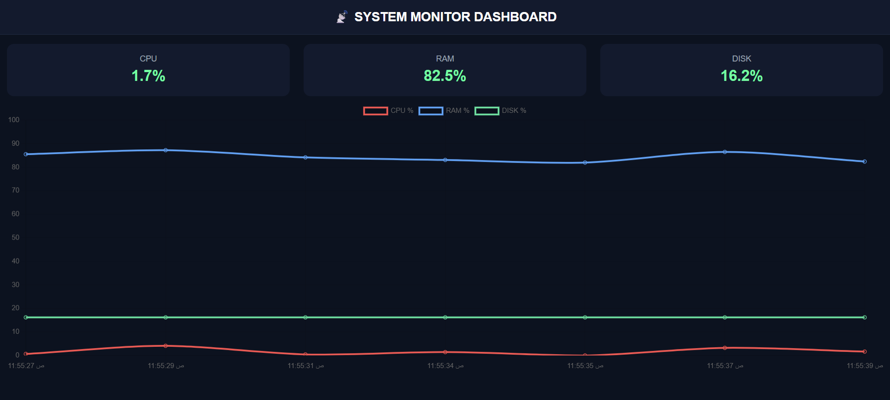
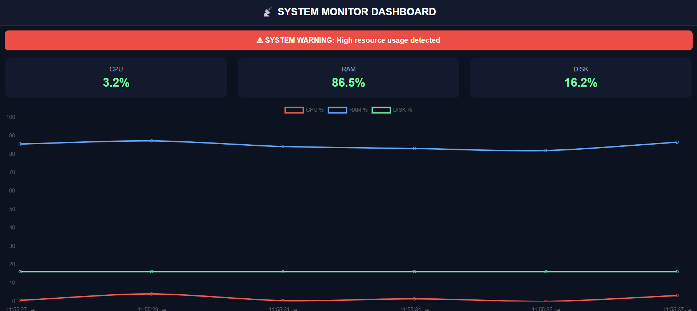

# 📡 Flask System Monitor Dashboard

A real-time system monitoring dashboard built with Flask and psutil, featuring live charts and auto-refreshing UI.

---

## 🚀 Features

- 📊 Real-time CPU monitoring
- 🧠 Live RAM usage tracking
- 💾 Disk usage visualization
- 🔄 Auto-refresh dashboard (no page reload)
- 📈 Interactive charts using Chart.js
- 🌙 Clean dark-mode UI

---

## 🧠 Tech Stack

- Python (Flask)
- psutil
- HTML / CSS
- JavaScript (Chart.js)
- Bootstrap

---

## 📊 Dashboard Preview

## 📸 Screenshots

### Dashboard View 1


### Dashboard View 2


## ⚙️ Installation

```bash
git clone https://github.com/sewar1/flask-system-monitor.git
cd flask-system-monitor
pip install -r requirements.txt
python app.py
